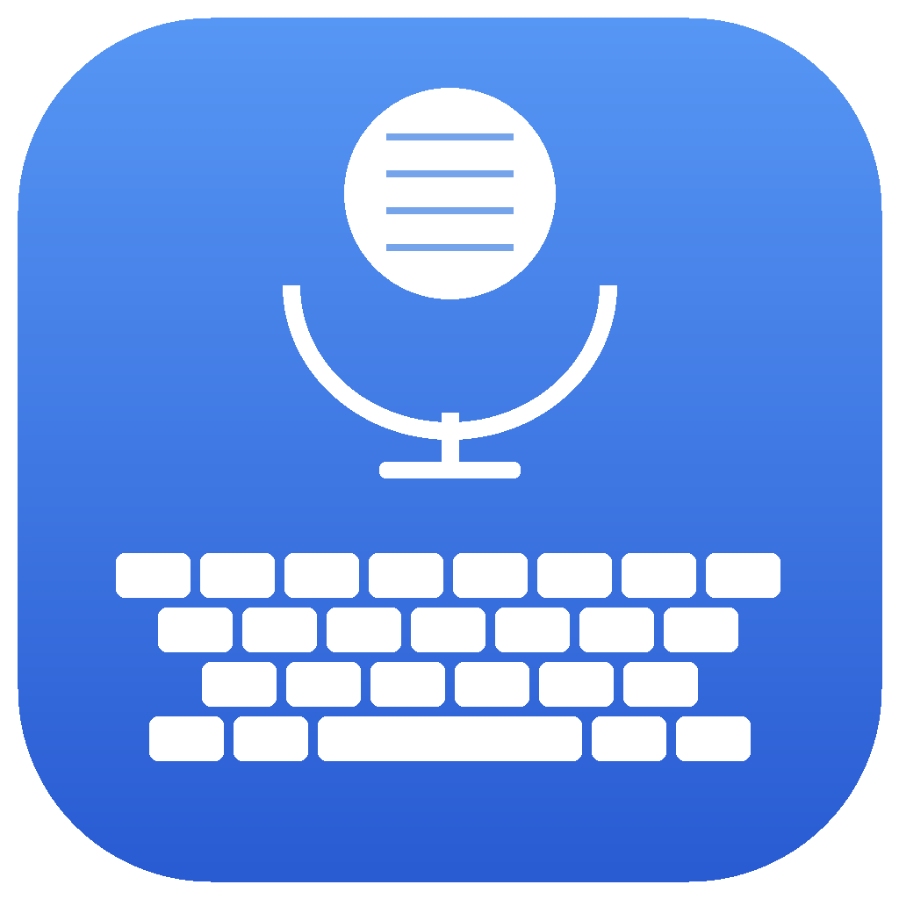
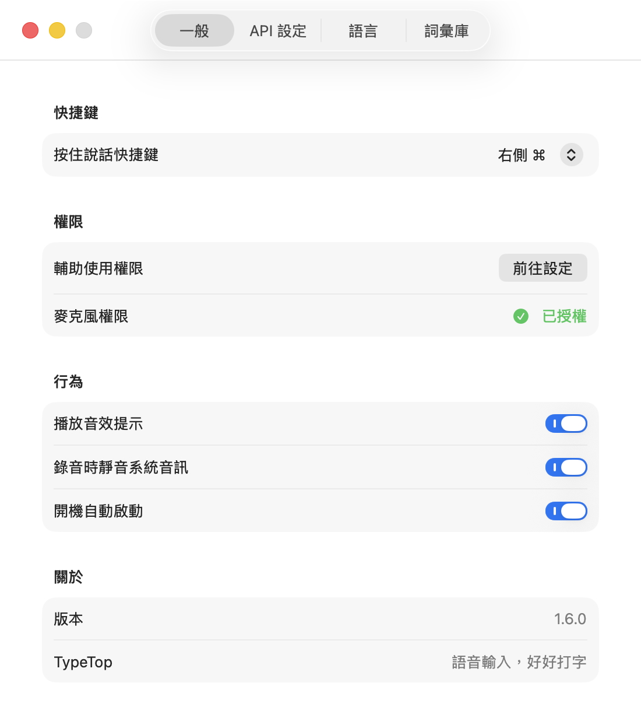
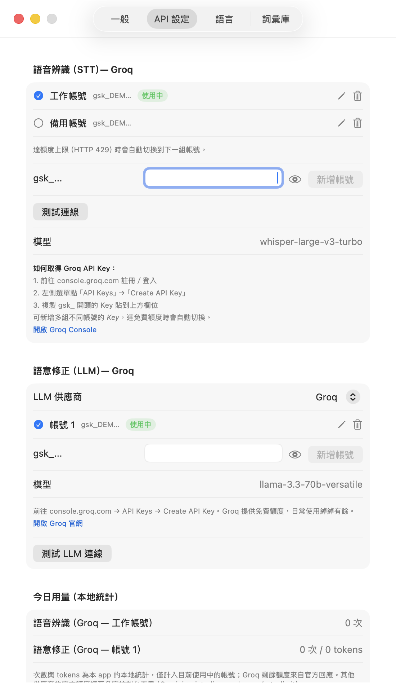
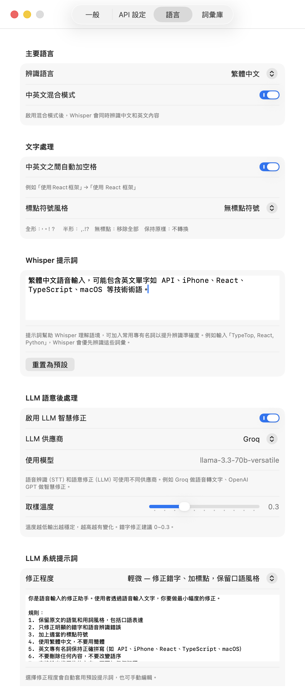
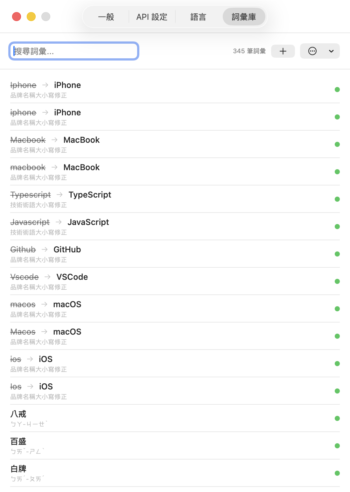

# TypeTop

[繁體中文](README.md) · [简体中文](README.zh-Hans.md) · **English** · [日本語](README.ja.md) · [한국어](README.ko.md)

**Voice input for macOS — hold Right ⌘, talk, and let go. The text lands wherever your cursor is.**

[](https://github.com/Lance70176/TypeTop/releases/latest)




---

## Install

**➡️ [Download TypeTop.dmg (latest)](https://github.com/Lance70176/TypeTop/releases/latest/download/TypeTop.dmg)**　·　[All releases and changelogs](https://github.com/Lance70176/TypeTop/releases)

1. Open the DMG and drag **TypeTop** into your Applications folder
2. If macOS blocks the first launch (the app isn’t notarized): **System Settings → Privacy & Security**, scroll to the bottom and click **Open Anyway**
3. Grant the **Microphone** and **Accessibility** permissions when asked (Accessibility is what lets TypeTop type for you — without it nothing gets inserted)
4. Click the microphone icon in the menu bar → **Preferences → API**, and paste in a Groq API key
5. Put your cursor in any text field, **hold Right ⌘**, speak, and release

> Requirements: **Apple Silicon** (M1 or later) and **macOS 14.0 Sonoma** or later.

---

## Features

### Input

- **Push-to-talk** — hold the key to record, release to transcribe and type. You never leave the app you’re in
- **Pick your own key** — Right ⌘ (default), Left ⌘, either ⌥, either ⌃, or fn
- **Works everywhere** — text is inserted as system-level keyboard events, so any text field in any app accepts it
- **Cancel mid-sentence** — press another modifier (⌥ / ⌃ / fn) while recording and nothing gets typed
- **Recording overlay and sounds** — a corner overlay shows recording state and input level, the menu bar icon changes too, and the sound cues can be turned off
- **Mutes system audio while recording** — background music or video won’t bleed into your microphone
- **Lives in the menu bar** — no Dock icon, with an optional launch-at-login
- **Five interface languages** — Traditional Chinese, Simplified Chinese, English, Japanese and Korean, switchable on the spot without restarting

### Recognition and correction

- **Speech recognition (STT)** — Groq Whisper `whisper-large-v3-turbo`: fast, with a free tier that covers everyday use
- **LLM correction** — a second pass fixes typos and adds punctuation, across 8 providers including a **fully offline** Apple on-device model
- **Four correction levels** — from “punctuation only” to “restructure the sentences”, and you can edit the system prompt directly
- **Adjustable temperature** — 0.3 by default; lower is steadier
- **Mixed-language mode** — sentences that mix your primary language with English are recognized correctly
- **Punctuation style** — full-width `，。！？`, half-width `,.!?`, strip all, or leave untouched
- **Auto-spacing between CJK and Latin** — `使用React框架` → `使用 React 框架`
- **Whisper prompt** — tell Whisper the proper nouns you use often and accuracy goes up

### Accounts and quota

- **Multiple API accounts** — store several keys per provider, each with a name you choose (“Work”, “Backup”, …)
- **Automatic failover** — when a key returns HTTP 429 (quota exhausted), TypeTop moves to the next account and keeps going
- **View / edit keys** — open an existing account to change its name or key without deleting and re-adding it, so its usage stats carry over
- **Usage stats** — today’s STT/LLM request and token counts, plus the live remaining quota Groq reports

### Vocabulary

- **Replacement rules** — fix words the recognizer keeps missing (`太好了` → `TypeTop`, `派森` → `Python`), each rule individually toggleable
- **Zhuyin dictionary import** — reads the personal dictionary exported by the macOS Zhuyin input method (`.txt`); frequent terms are fed to the LLM to fix homophone errors
- **JSON import / export** — for backups or sharing

---

## Screenshots

> The screenshots below show the Traditional Chinese interface; the app itself is available in five languages.

### General

Shortcut, interface language, permission status and behavior toggles.



### API

Every provider can hold several accounts and fails over automatically; today’s usage is at the bottom.



### Language

Recognition language, text processing, the Whisper prompt, and the LLM correction level and temperature.



### Vocabulary

Fix frequently misrecognized words; supports Zhuyin dictionaries and JSON import/export.



---

## API keys

TypeTop needs at least one **Groq API key** (for speech recognition) to work.

### Speech recognition (STT) — Groq

1. Go to [console.groq.com](https://console.groq.com/keys) and sign up or log in
2. In the sidebar, choose “API Keys” → “Create API Key”
3. Copy the key starting with `gsk_`, paste it under **API → Speech recognition**, and press “Add account”

> Groq’s free tier is plenty for everyday dictation. If you run out, create a second account, add its key, and TypeTop will switch over automatically.

### Text correction (LLM)

Pick a provider under **API → Text correction** and paste in its key:

| Provider | Default model | API key needed | Where to get it |
|--------|---------|:---:|-------------|
| OpenAI | `gpt-4o-mini` | ✅ | [platform.openai.com](https://platform.openai.com/api-keys) |
| Groq | `llama-3.3-70b-versatile` | ✅ | [console.groq.com](https://console.groq.com/keys) |
| DeepSeek | `deepseek-chat` | ✅ | [platform.deepseek.com](https://platform.deepseek.com/api_keys) |
| Moonshot (Kimi) | `kimi-k2.5` | ✅ | [platform.moonshot.ai](https://platform.moonshot.ai/console/api-keys) |
| Google Gemini | `gemini-3.1-flash-lite` | ✅ | [aistudio.google.com](https://aistudio.google.com/apikey) |
| **Apple on-device** | built into the OS | ❌ | Nothing to configure; needs macOS 26+ with Apple Intelligence on |
| Ollama (local) | `llama3` | ❌ | [ollama.com](https://ollama.com) |
| Custom | your own | depends | Any OpenAI-compatible Chat Completions endpoint |

> STT and LLM can use different providers — Groq for transcription and OpenAI for correction, for instance.
> To keep everything on your Mac, set the LLM to **Apple on-device** or **Ollama**.

---

## Preferences

### General

| Setting | What it does |
|------|------|
| Push-to-talk key | Choose the activation key; seven modifiers available |
| Interface language | Switch the app’s language — the same five as the recognition languages, applied instantly |
| Accessibility | Without it TypeTop can’t type; click “Open Settings” to grant it |
| Microphone | Without it TypeTop can’t record |
| Play sound effects | Cues when recording starts and stops |
| Mute system audio while recording | Drops system volume during recording so background sound isn’t captured |
| Launch at login | Start TypeTop when you log in |

### Language

| Setting | What it does |
|------|------|
| Recognition language | Your primary language (Traditional Chinese by default). Switching it also updates the Whisper and LLM prompts, unless you edited them yourself |
| Mixed-language mode | Recognizes your primary language and English in the same sentence |
| Auto-space between CJK and Latin | `使用React框架` → `使用 React 框架` |
| Punctuation style | Full-width / half-width / none / leave as-is |
| Whisper prompt | Proper nouns you say often, to improve accuracy |
| Enable LLM correction | Turn it off to get Whisper’s raw output |
| Correction level | None / light / medium / heavy — each applies its own default prompt |
| Temperature | Lower is steadier; 0–0.3 is best for fixing typos |
| LLM system prompt | Edit it freely to set the tone or domain vocabulary |

### Vocabulary

Fixes the words the recognizer keeps getting wrong:

| Misrecognized (from) | Correct text (to) | Note |
|---|---|---|
| 太好了 | TypeTop | App name |
| 瑞乃特 | React | Frontend framework |
| 派森 | Python | Programming language |

- Press **+** to add a rule; each can be enabled or disabled on its own
- **JSON import / export** for backups and sharing
- Imports the **macOS Zhuyin personal dictionary** (`.txt`)

---

## FAQ

**Nothing happens when I hold ⌘.**
Check that the microphone icon is in the menu bar, then look at **Accessibility** on the General tab. After reinstalling or updating, the permission sometimes needs to be re-granted.

**Recognition isn’t accurate enough.**
Three knobs: add proper nouns to **Language → Whisper prompt**, create replacement rules in **Vocabulary**, and raise the **correction level** so the LLM does more of the cleanup.

**I ran out of quota.**
Add a second account for the same provider on the API tab — TypeTop switches over on HTTP 429. You can also move the LLM to the Apple on-device model or Ollama, which use no cloud quota at all.

**Can I change the interface language?**
Yes — **General → Interface language** offers Traditional Chinese, Simplified Chinese, English, Japanese and Korean, applied immediately without a restart. That’s separate from **Language → Recognition language**, which decides what you speak and what gets written.

**Where does my audio go?**
Audio only goes to the STT provider you configured (Groq); the text correction goes to whichever LLM provider you picked. With the Apple on-device model or Ollama, correction happens entirely on your Mac. API keys are stored in the local Keychain and in the app support directory (mode 0600).

---

## Development

The Xcode project is managed with [XcodeGen](https://github.com/yonaskolb/XcodeGen).

```bash
# Install XcodeGen
brew install xcodegen

# Generate the Xcode project
xcodegen generate

# Open it
open TypeTop.xcodeproj
```

### Building the DMG

```bash
cd build
./build_dmg.sh
```

The DMG lands at `build/TypeTop.dmg`.

---

## Architecture

| Component | Technology |
|------|------|
| UI | SwiftUI + AppKit |
| Hotkey | CGEvent tap (configurable modifier, Right ⌘ / keyCode 54 by default) |
| Recording | AVFoundation (16 kHz, 16-bit, mono WAV) |
| Speech recognition | Groq Whisper API (whisper-large-v3-turbo) |
| Text correction | Multi-provider LLMs (OpenAI-compatible Chat Completions) + Apple FoundationModels |
| Text insertion | Simulated CGEvent keyboard events |
| Storage | UserDefaults + Keychain (API keys) + `apiaccounts.json` (multi-account, 0600) |
| Localization | In-app string tables with runtime switching (`TypeTop/Localization`) |
| Project | XcodeGen (project.yml) |
